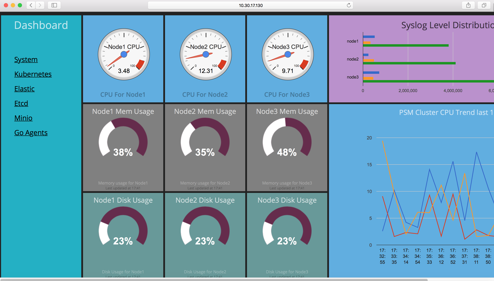
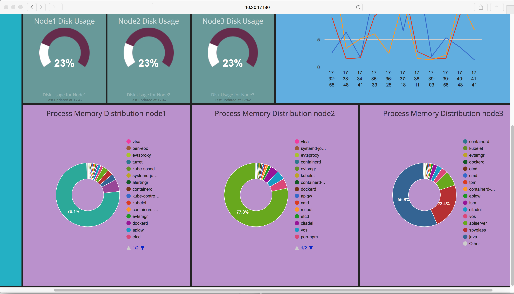
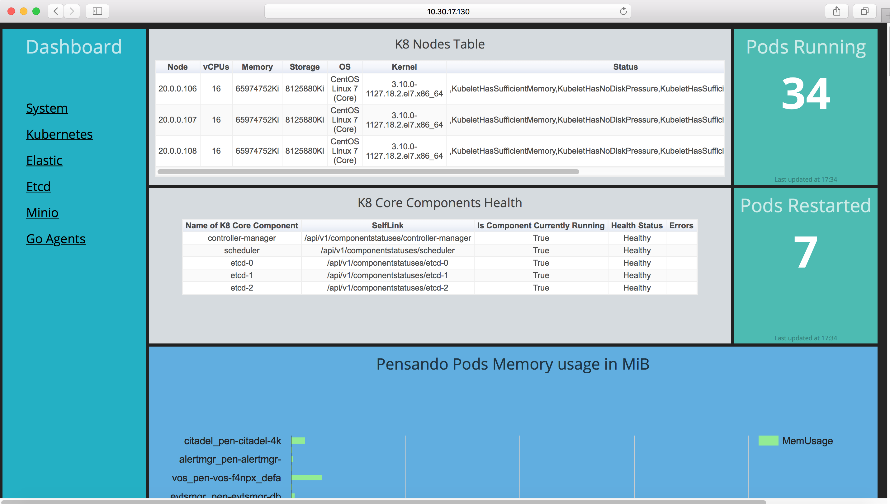
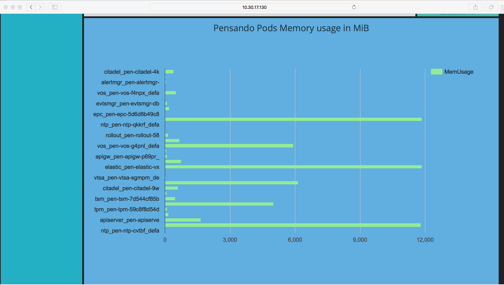
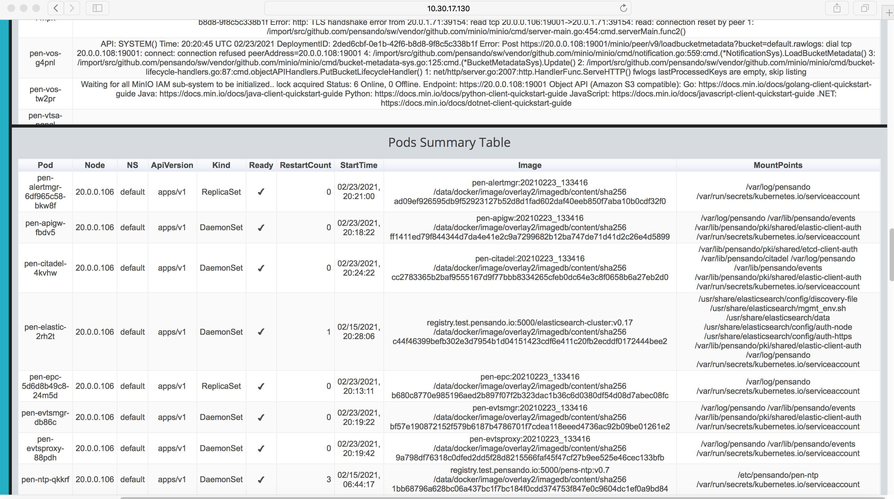
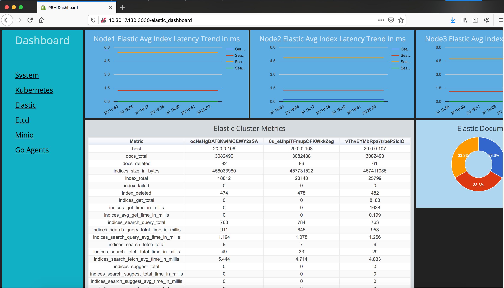
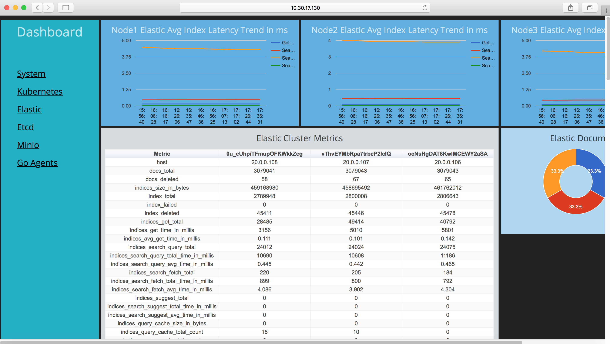
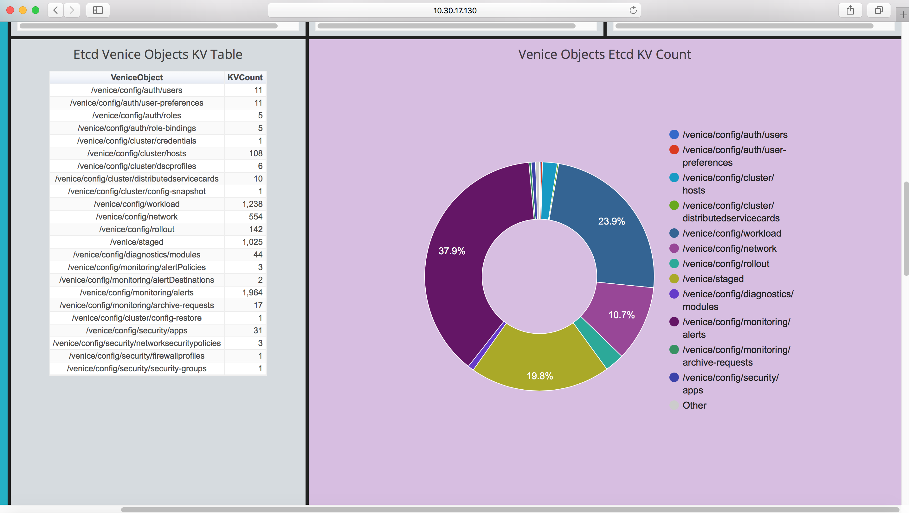
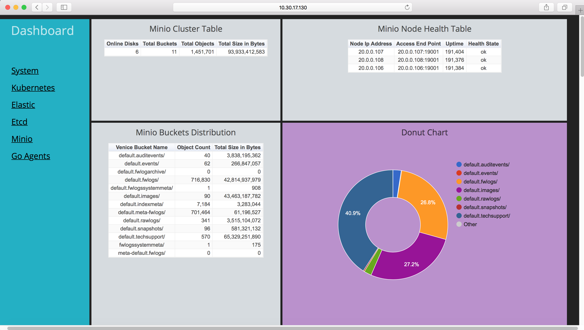

# psm-tools
PSM Dashboard repository which has a collection of dashboards built using smashing dashboards and Google chart widgets to view system resources and cluster metrics from PSM cluster. It also has a collection of libraries built using Python SDK for Elastic, Etcd, Minio that lets you to connect to these distributed data stores within the PSM cluster and collect rich cluster metrics which can help troubleshoot complex issues. In addition to this has libraries to connect to the Kubernetes master node and get the complete state of the cluster from K8 view.

Please refer https://smashing.github.io/ to know more about Smashing dashboard infrastructure.

# Install Procedure
1. Install Ruby versions 2.5.0 or greater and Python3
2. Install smashing dashboards project using documentation under https://smashing.github.io/#getting-started
3. The above will create a default dashboard project by name sweet_dashboard_project under /var/www/html/
4. Do a Git clone of this repo under /var/www/html/sweet_dashboard_project
5. Install influxDB and MongoDB on the server - Depending on the flavor of Linux used, use the appropriate tools for installation ( apt-get or yum  etc. ).
https://influxdbcom.readthedocs.io/en/latest/content/docs/v0.6/introduction/installation/
https://docs.mongodb.com/manual/administration/install-on-linux/
5. Pip install the various Python SDK modules needed for SDKs used in this project.
pip3 install kubernetes
pip3 install elasticsearch
pip3 install etcd3
pip3 install minio
pip3 install influxdb
pip3 install pymongo
pip3 install paramiko
pip3 install netmiko

# Snapshots

  <h2>System Dashboard - CPU/Memory/Disk Usage</h2>
  
  <h2>System Dashboard - Process Memory Distribution</h2>
  
  <h2>Kubernetes Dashboard - Nodes health</h2>
  
  <h2>Kubernetes Dashboard - Containers Memory Usage</h2>
  
  <h2>Kubernetes Dashboard - Pods Details</h2>
  
  <h2>Elastic Dashboard - Cluster Metrics</h2>
  
  <h2>Etcd Dashboard - Cluster Metrics</h2>
  
  <h2>Etcd Dashboard - PSM Objects Summary</h2>
  
  <h2>Minio Dashboard - Object Summary</h2>
  

